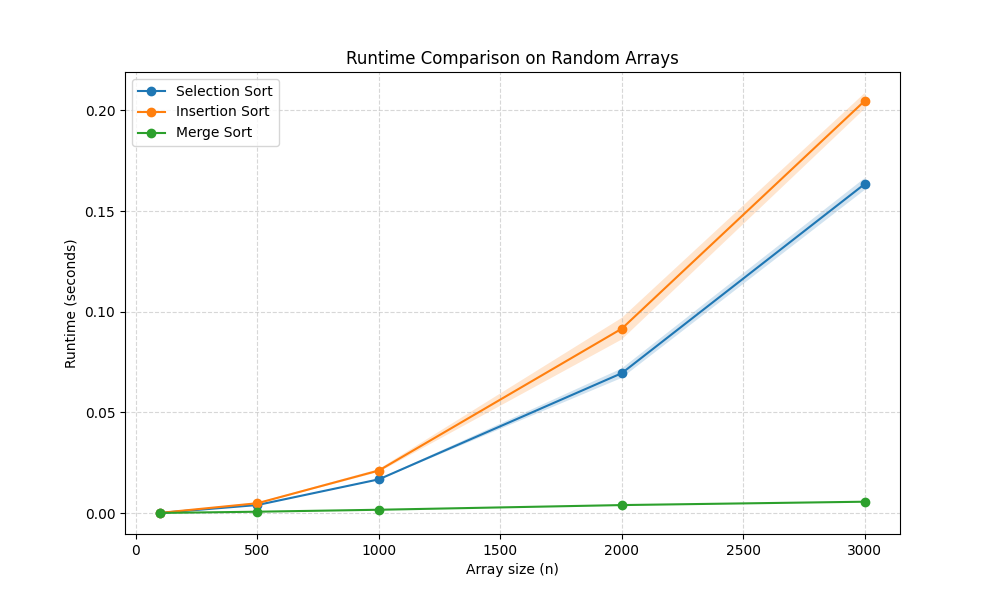
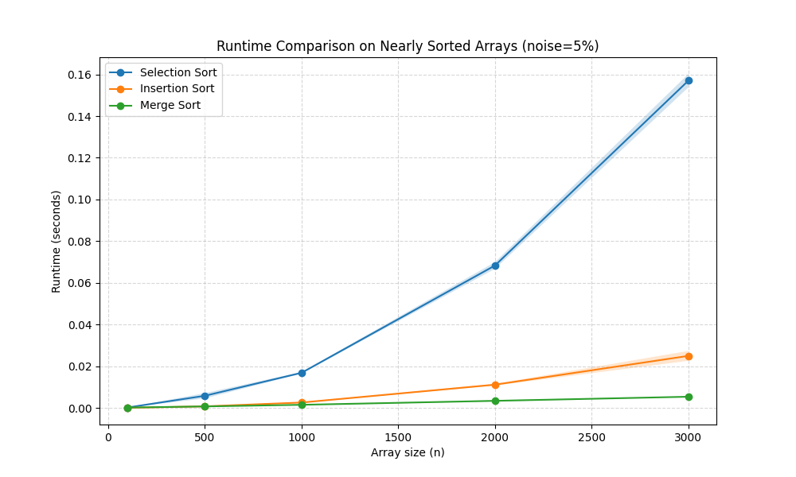

# Data Structures - Python Assignment 1 - Sorting Algorithms

# Students:
Gal Dekel & Ziv Goldstein 

# Selected Algorithms:
- Selection Sort 
- Insertion Sort  
- Merge Sort   

## Results – Part B (Random Arrays)



### Explanation of graph results

The graph shows the running times of the three algorithms on random arrays of increasing sizes.
Each experiment was repeated multiple times for every array size, and the average running time and standard deviation were calculated.

Insertion Sort and Selection Sort both grow much faster than Merge Sort as the input size increases.
This is expected because their time complexity is (O(n^2)).

Merge Sort grows much more slowly than the other two algorithms.
Its time complexity is (O(n \log n)), making it significantly better for large inputs.

## Results – Part C (Nearly Sorted Arrays)



### Explanation of graph results

In this experiment, we started from a fully sorted array and then added a controlled amount of noise by randomly swapping elements.  
We tested the algorithms on nearly sorted arrays in order to compare their behavior to the random-array case from Part B.

- Insertion Sort performs significantly better on nearly sorted arrays than on random arrays.  
  This happens because the algorithm is very efficient when only a small number of elements are out of place.

- Selection Sort does not improve much even when the array is almost sorted.  
  This is because it still scans the unsorted part of the array in the same way, so its running time remains close to \(O(n^2)\).

- Merge Sort remains efficient and stable regardless of whether the input is random or nearly sorted.  
  Its running time is still approximately \(O(n \log n)\), since its divide-and-conquer structure does not depend strongly on the initial order of the input.

## Part D – Command Line Interface

In this part, we extended the program so that experiments can be run directly from the command line using `argparse`.  
This allows the user to control the parameters of the experiment without changing the code itself.

The program supports the following arguments:

- `-a` – selects which algorithms to run
- `-s` – selects the input sizes
- `-e` – selects the experiment type / noise level
- `-r` – selects the number of repetitions

### Example Run

```bash
python run_experiments.py -a 2 3 4 -s 100 500 1000 3000 -e 1 -r 5

- Insertion Sort and Selection Sort both grow much faster than Merge Sort as the input size increases.  
  This is expected because their time complexity is \(O(n^2)\).

- Merge Sort grows much more slowly than the other two algorithms.  
  Its time complexity is \(O(n \log n)\), making it significantly better for large inputs.


